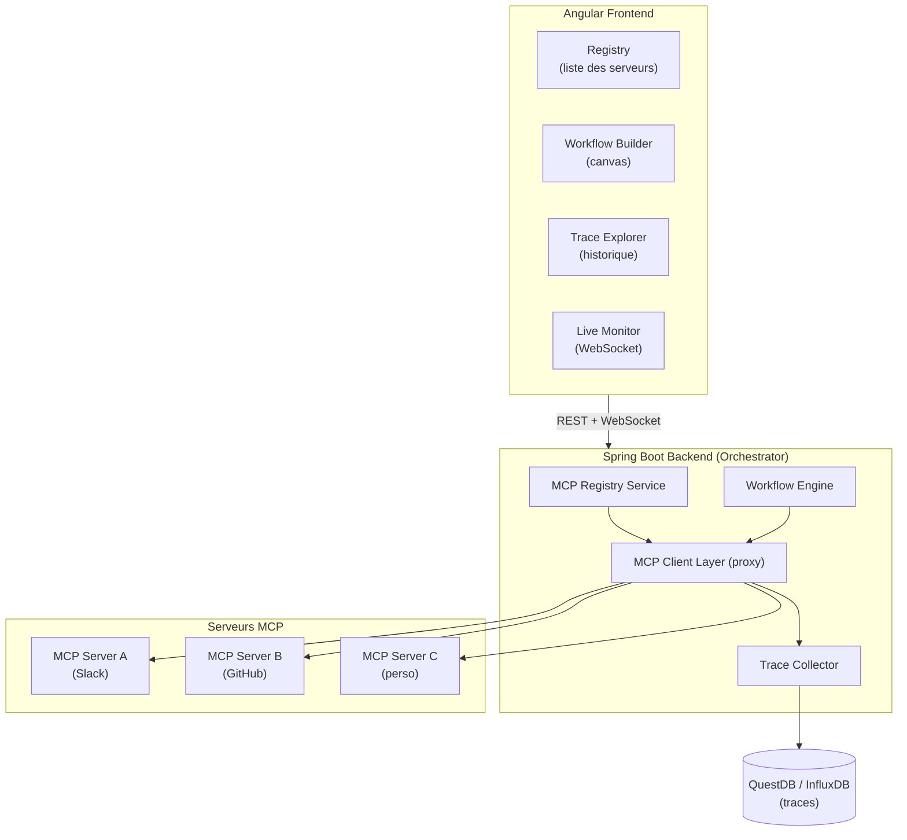
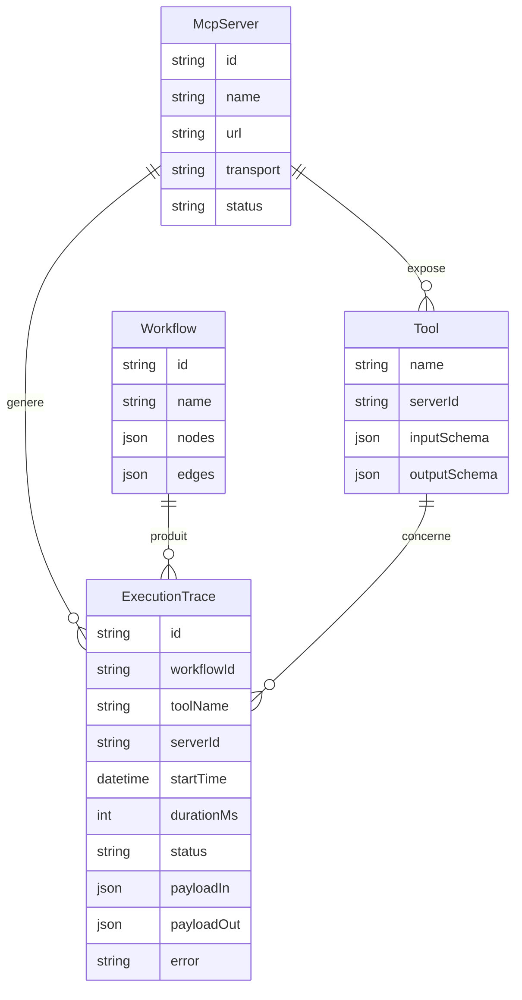
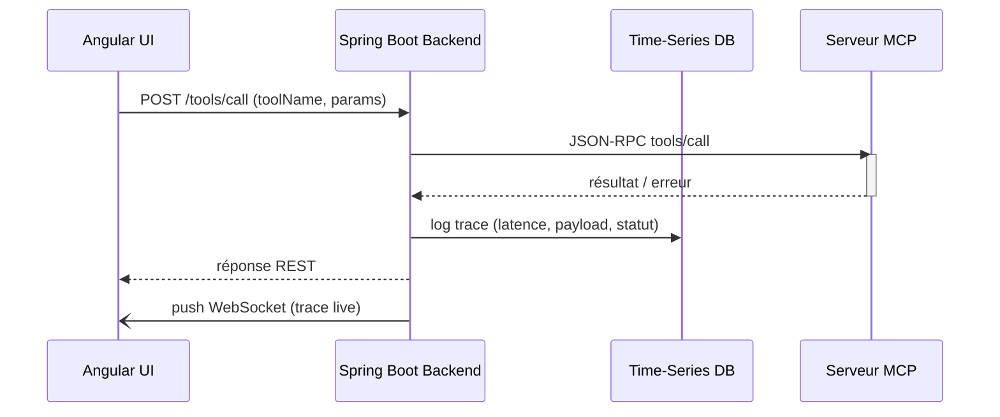
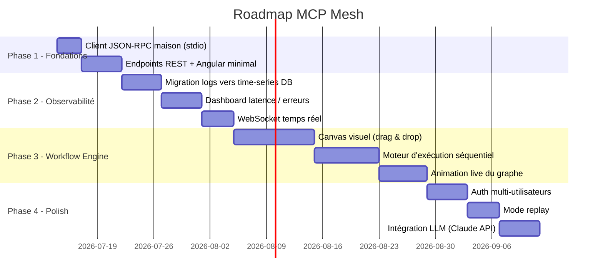

# MCP Mesh

Plateforme d'orchestration et d'observabilité pour serveurs MCP (Model Context Protocol). Connecte plusieurs serveurs MCP, permet de chaîner leurs tools en workflows visuels, et observe en temps réel chaque appel (latence, payload, erreurs).

## 1. Pitch

Le protocole MCP est encore jeune : il n'existe pas aujourd'hui d'outil grand public dédié à l'observabilité MCP (à la manière de ce que LangSmith fait pour LangChain). MCP Mesh comble ce vide en proposant :

- Un **registre** de serveurs MCP connectés
- Un **constructeur de workflows** visuel pour chaîner des tools entre serveurs
- Un **collecteur de traces** qui journalise chaque appel (latence, payloads, erreurs) dans une base time-series
- Un **monitoring live** avec animation du graphe d'exécution en temps réel
- 
## 2. Stack technique

| Couche | Techno | Justification |
|---|---|---|
| Frontend | Angular (Signals, standalone components, nouveau control flow) | Imposé — objectif d'apprentissage |
| Backend | Spring Boot / Spring AI | Orchestration, proxy MCP, montée en compétence Spring AI |
| Traces | QuestDB / InfluxDB | Réutilisation d'une expertise time-series déjà acquise |
| Visualisation graphe | Cytoscape.js ou ngx-graph | Rendu du graphe de workflow et son animation live |
| Temps réel | WebSocket | Streaming des traces d'exécution vers le front |
| Déploiement | Docker sur TrueNAS | Cohérent avec l'infra personnelle existante |

## 3. Architecture générale



## 4. Modèle de données (simplifié)



## 5. Flux d'un appel de tool (séquence)



## 6. Roadmap



## 7. Tester manuellement l'endpoint `/servers/connect`

En attendant un test automatisé (`MockMvc`/`TestRestTemplate`), voici comment vérifier à la main que l'orchestrateur parle bien à un vrai serveur MCP via `McpClient`. On utilise `FakeMcpServer` (situé dans les sources de test de `client`) comme faux serveur MCP à connecter.

**1. Compiler `client`** (pour avoir les `.class` de `FakeMcpServer`, y compris ses sources de test) :
```bash
cd backend/client
./gradlew compileTestJava
```

**2. Construire le classpath de `FakeMcpServer`** — il a besoin des classes compilées de `client` (main + test) et des jars Jackson (`tools.jackson`) :
```bash
JACKSON_DATABIND=$(find ~/.gradle/caches -iname "jackson-databind-3*.jar" | grep -v sources | grep -v javadoc | head -1)
JACKSON_CORE=$(find ~/.gradle/caches -iname "jackson-core-3*.jar" | grep -v sources | grep -v javadoc | head -1)
JACKSON_ANNOT=$(find ~/.gradle/caches -iname "jackson-annotations-2*.jar" | grep -v sources | grep -v javadoc | head -1)
CP="backend/client/build/classes/java/test:backend/client/build/classes/java/main:$JACKSON_DATABIND:$JACKSON_CORE:$JACKSON_ANNOT"
```

**3. Démarrer l'orchestrateur** (depuis `backend/orchestrator`) :
```bash
cd backend/orchestrator
./gradlew bootRun
```

**4. Appeler l'endpoint**, dans un autre terminal — la commande à connecter est celle qui lance `FakeMcpServer` avec le classpath construit à l'étape 2 :
```bash
curl -X POST http://localhost:8080/servers/connect \
  -H "Content-Type: application/json" \
  -d "{\"command\": [\"java\", \"-cp\", \"$CP\", \"com.mcpmesh.client.FakeMcpServer\"]}"
```

**Résultat attendu (succès)** — `200 OK` :
```json
{"result":{"protocolVersion":"2024-11-05","capabilities":{},"serverInfo":{"name":"fake-mcp-server","version":"0.0.1"}}}
```

**Vérifier aussi le chemin d'erreur**, avec une commande invalide — `400 Bad Request` attendu :
```bash
curl -X POST http://localhost:8080/servers/connect \
  -H "Content-Type: application/json" \
  -d '{"command": ["this-command-does-not-exist"]}'
```
```json
{"message":"Cannot run program \"this-command-does-not-exist\": ..."}
```

# Contribution

Aucune contribution n'est attendue sur ce projet.
Développeur principal : [Théo DULUARD](mailto:theo.duluard7@gmail.com)